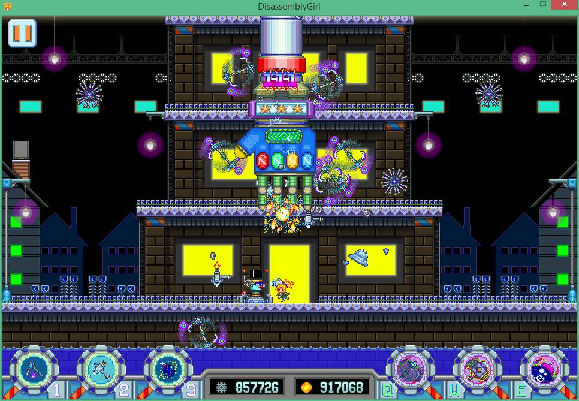
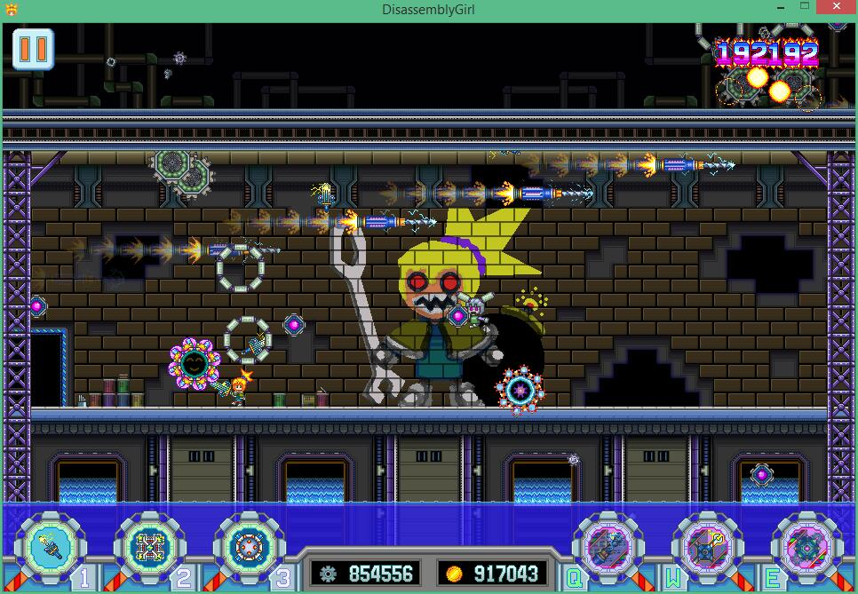
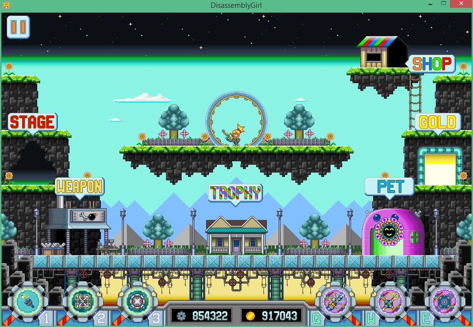
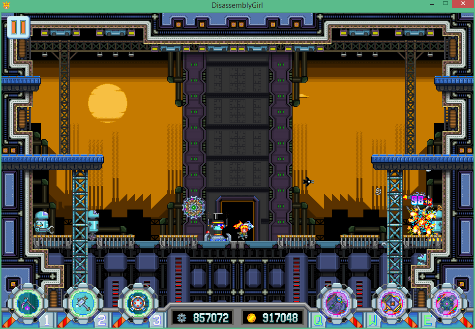

# disassembly-girl
This is a tiny but refined indie game, it was developed with unity3d 5.4 version, We did not plan to continue maintaining and updating any of the game content. But you can modify it, customize it as long as you interesting in it. This project include all the source code and resources.

Last but not least, this is the game I made with my brother, thanks for a passion and dream for indie games.

### Features

* Simple operation only control mouse to click screen.
* Retro music sound effect.
* Pixel style art design.

### Screenshot

### Contact
If you have any questions about the game, please leave a message or send an email.
